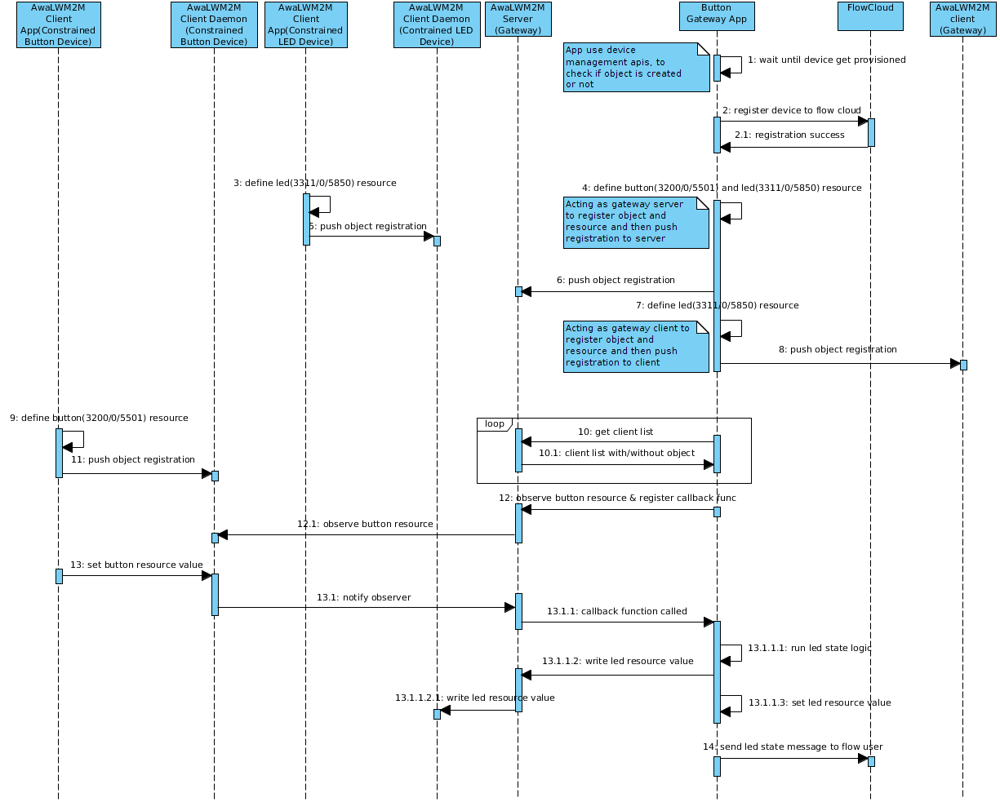

# Button Gateway application

## Overview
Button gateway application runs on Ci40 board, which acts as a gateway for MikroE boards. One of the MikroE boards acts as awalwm2m client to simulate button, and another one also acts as awalwm2m client to simulate led. Gateway application observes any button presses on former board, and whenever there is a change, gateway application gets a notification for the same, and take further actions. After receiving notification for button change, gateway application

- Change led state to ON or OFF, depending upon button events.
- Sets the led state on awalwm2m client running on Ci40, so that the observer gets the notification on the value change.
- Sends a flow message to FlowM2M user's account with ON or OFF status of led.

Gateway application serves two purposes:
- It acts as Awalwm2m server to communicate with Awalwm2m client that is running on a constrained device.
- It acts as Awalwm2m client to communicate with Awalwm2m server on FlowM2M

| Object Name     | Object ID      | Resource Name | Resource ID |
| :----           | :--------------| :-------------| :-----------|
| "Digital Input" | 3200           | "Counter"      | 5501        |
| "Actuation"     | 3311           | "On/Off"       | 5850        |

## Revision History
| Revision  | Changes from previous revision |
| :----     | :------------------------------|
| 0.9.0     | External Beta Trial Release    |

## Prerequisites
Prior to running button gateway application, make sure that:
- Awalwm2m client daemon(awa_clientd) is running.
- Awalwm2m server daemon(awa_serverd) is running.
- Awalwm2m bootstrap daemon(awa_bootstrapd) is running.
- Device provisioning is done.

**NOTE:** Please do "ps" on console to see "specific" process is running or not.

## Application flow diagram


## API guide

Button Gateway documentation is available as a Doxygen presentation which is generated via the following process.

  1. Install [Doxygen ](http://www.stack.nl/~dimitri/doxygen/download.html): ```` sudo apt-get install doxygen````
  2. Generate the documentation:

        $ button-gateway: mkdir build
        $ button-gateway/build: cd build
        $ button-gateway/build: cmake ../docs
        $ button-gateway/build: make docs

The output can be found in the build/html directory and viewed by opening index.html with your web browser.

## Running Application on Ci40 board
Button Application is getting started as a daemon. Although we could also start it from the command line as :

*$ button_gateway*

Output looks something similar to this :
```
Button Gateway Application

------------------------


Client session established


Server session established


Wait until device is provisioned

Waiting...

Gateway is provisioned.


Waiting for config data

Waiting for config data

Failed to read config file

Try to connect to Flow Server for 5 more trials..


Device registration successful

Defining flow objects on server

Defining flow objects on client

Waiting for constrained device 'ButtonDevice' to be up

Constrained device ButtonDevice registered

Waiting for constrained device 'LedDevice' to be up

Constrained device LedDevice registered

Written 1 to server.


Set 1 on client.


Message sent to user = 12:36:10 18-03-2016 LED on

Written 0 to server.


Set 0 on client.


Message sent to user = 12:36:11 18-03-2016 LED off
```
>>>>>>> dev
